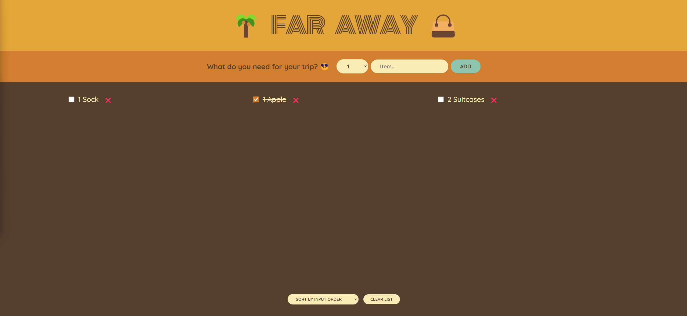

# Project Travel List 🏖️

The goal of this repo is to practice the following skill sets:

- React framework
    - Hooks,
    - Props
    - JSX syntax
    - **State**: primary objective of this project
        - `useState` & `Derived state`
        - `Lifting state up`
        - `Fundamentals of State managment`
    

- Thinking in React
- Chrome React DevTools & Debugging
- Components creation

## Summary

**React** was the main focus of this project. It is the first project that is solely built by using it, helping me practising state management and how state works in general.

I struggled with how lifting state works and sometimes how derived state functions, I tested a lot with the _React DevTools_ which helped me tremendously assessing how state changes.


## Links

 [Code](https://github.com/Frenzy017/travel-list)

## Screenshots

> Normal View




## Deployment

Clone with Git:
```sh
git clone https://github.com/Frenzy017/travel-list.git
```

CD into the project:
```sh
cd travel-list
```

Install Node modules:
```sh
npm install
```

Run project:
```sh
npm start
```
